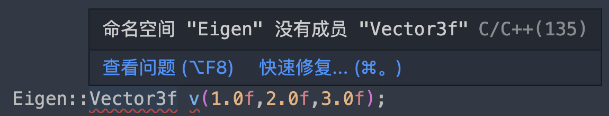

- ## 环境配置
	- ### 环境
		- OS and Verison: mac m1 12.4
		- vscode version: 1.73.1
		- c/c++ extension pack version: v1.3.0
	- ### 问题描述
		- 
	- ### 解决方案
		- 在源代码中插入
		- ```code
		  #if __INTELLISENSE__
		  #undef __ARM_NEON
		  #undef __ARM_NEON__
		  #endif
		  ```
		-
		- [参考issue](https://github.com/microsoft/vscode-cpptools/issues/7413)
	-
	-